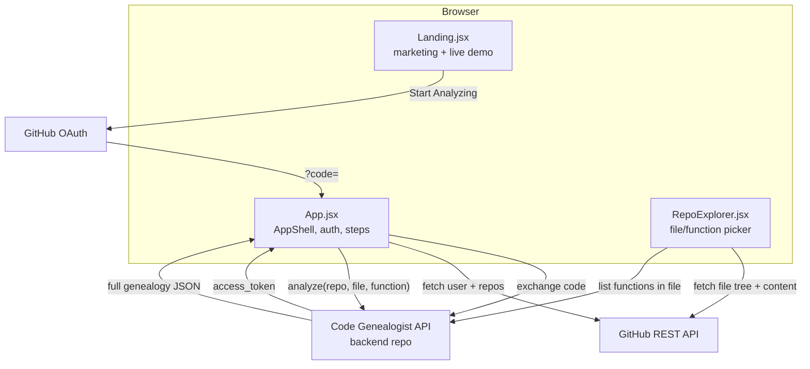

<div align="center">

# Code Genealogist

**See why your code looks the way it does.**

A developer tool that traces a single function's history across a Git repository and explains — in plain English — what changed between versions and why.

[](https://react.dev/)
[](https://vitejs.dev/)
[](https://code-genealogist-ui.vercel.app)
[](./LICENSE)

[Live app](https://code-genealogist-ui.vercel.app) · [Backend API repo](https://github.com/ananya24s/CodeGenealogist) · [Report a bug](https://github.com/ananya24s/Code-genealogist-ui/issues)

</div>

---

## What is this?

Ever opened a function, seen something that looked wrong or overly defensive, and wondered *"why is this written like this?"* — and then spent ten minutes in `git blame` and `git log -p` piecing it together from noisy, function-agnostic diffs?

**Code Genealogist** is the UI for doing that in seconds instead of minutes. Connect a GitHub repo, pick a file, pick a function — and it reconstructs that one function's full history: every version it went through, what changed between each pair of versions, and an AI-generated explanation of *why*.

This repository is the **frontend** — a React app that handles GitHub OAuth, lets you browse a repository's real files and functions (no typing exact paths from memory), and renders the resulting history as an interactive dashboard. The actual git archaeology and AI classification happen in the **[companion backend API](https://github.com/ananya24s/CodeGenealogist)**.

### The problem it solves

- `git log -p -- file.py` shows you every change to the *whole file*, including functions you don't care about
- Commit messages rarely explain *why* — "fix", "cleanup", "update" tell you nothing
- There's no single view of one function's story from creation to its current state
- Most tools that touch this space assume you already know the exact file path and function name — this one lets you *browse* to it instead

---

## Key features

- **GitHub OAuth** — connect your account, browse repos you actually have access to (public or private)
- **Guided file/function picker** — a searchable file browser plus a real function list per file (not free-text entry), so a typo can't silently break the analysis
- **Function evolution timeline** — a vertical "core sample" of every version, color-coded by change type, with milestone markers for high-confidence changes
- **Real line-level diffs** — an LCS-based unified diff (the same algorithm class as `git diff`) between consecutive versions, plus a side-by-side alternate view
- **AI-generated insight** — what changed, why, and its likely impact, per change, with a confidence score
- **Honest staged loading UI** — analysis is a single long backend request with no streaming progress, so instead of a generic spinner or a fake progress bar, the loading screen shows realistic pipeline stages (cloning, extraction, classification, etc.) and is explicit that it's an estimate, including an inline note if a request is taking cold-start-length time
- **A whole custom design system** ("Blueprint") — technical-drawing-inspired visual language (navy/cyan/copper, mono labels, drafting grid, draw-in line animations) applied consistently across every screen, not just the landing page
- **Respects `prefers-reduced-motion`** throughout — every animated surface (landing page sheets, loading stages, live demo) has a static fallback

---

## Screenshots

<!-- TODO: add screenshots -->
<!--
| Landing | Repository Registry | Explorer |
|---|---|---|
|  |  |  |

| Analysis loading | Results dashboard |
|---|---|
|  |  |
-->

*Screenshot placeholders — to be added.*

## Demo

**[code-genealogist-ui.vercel.app](https://code-genealogist-ui.vercel.app)**

<!-- TODO: embed a short screen recording of: login → pick repo → pick function → results dashboard -->

The landing page's hero panel is itself a small live demo — it animates through the *real* commit history of `extract_function()` in this project's own backend repository (actual commit hashes, actual diffs, actual AI-style insight text), on an 8–12 second loop.

> ⚠️ The backend runs on Render's free tier and sleeps after inactivity. The first analysis after idle can take up to a minute — the loading screen explains this rather than hiding it.

---

## Tech stack

| Layer | Choice | Why |
|---|---|---|
| Framework | [React 19](https://react.dev/) | Function components + hooks throughout, no class components |
| Build tool | [Vite](https://vitejs.dev/) | Fast dev server, minimal config |
| Styling | Plain CSS (no framework) | Custom design system ("Blueprint") — Tailwind's utility classes didn't fit a bespoke technical-drawing aesthetic |
| Icons | [lucide-react](https://lucide.dev/) | Consistent, tree-shakeable icon set |
| Fonts | [Space Grotesk](https://fonts.google.com/specimen/Space+Grotesk) (display) + [JetBrains Mono](https://www.jetbrains.com/lp/mono/) (technical/labels) | Loaded via Google Fonts |
| State | React hooks only | No Redux/Zustand — the app's state graph is small enough that prop drilling + `useState`/`useEffect`/`useRef` was the simpler choice |
| Auth | GitHub OAuth 2.0 | Code exchanged server-side by the backend API |
| Hosting | [Vercel](https://vercel.com/) | Auto-deploys on push, SPA rewrite via `vercel.json` |

No CSS-in-JS, no component library, no state management library. Every screen's styling lives in a plain `.css` file scoped by class name convention.

---

## Architecture overview



Three top-level components, one state machine:

- **`Landing.jsx`** — pre-login marketing page (unrelated to `App.jsx`'s state; swapped in wholesale while `isLoggedIn` is `false`)
- **`App.jsx`** — owns auth state and a `step` state machine (`'repos' → 'explore' → 'results'`), plus the shared `AppShell` (header, registration marks) all three steps render inside
- **`RepoExplorer.jsx`** — self-contained file/function picker rendered inside the `'explore'` step; talks to GitHub's API directly (using the token already in `localStorage`) for file browsing, and to the backend's `/functions` endpoint for function discovery

The frontend never touches the target repository's Git history directly — that's entirely the backend's job. The frontend's own GitHub API calls are limited to listing the user's repos, browsing one repo's file tree, and fetching one file's raw content.

---

## How it works internally

<details>
<summary><strong>Authentication flow</strong></summary>

<br>

`handleLogin()` redirects to `github.com/login/oauth/authorize` with `scope=repo`. GitHub redirects back to `VITE_GITHUB_CALLBACK_URL` with a `?code=` param. On mount, `App.jsx` checks for that param and — if there's no token in `localStorage` yet — calls the backend's `/auth/callback` to exchange it for an access token.

While that exchange is in flight, an `authenticating` state renders a dedicated `AuthenticatingScreen` instead of leaving the plain landing page visible with no feedback (an earlier version did exactly that, which meant a slow backend cold-start looked like the "Start Analyzing" click had done nothing — see [Lessons learned](#lessons-learned)). A separate `authError` state (not the same `error` state used elsewhere in the app) surfaces a failed exchange with a retry button, and `handleLogin` no-ops on rapid re-clicks while already authenticating.

</details>

<details>
<summary><strong>Repository & function selection</strong></summary>

<br>

`RepoExplorer` fetches the selected repo's file tree via GitHub's Git Trees API (`GET /repos/{repo}/git/trees/{ref}?recursive=1`), filtered to extensions the backend can actually parse (`.py .js .jsx .mjs .cjs .ts .tsx`). Selecting a file fetches its raw content via the Contents API, then POSTs that content to the backend's `/functions` endpoint, which returns every function it can find. The UI never asks the user to type a function name — every function offered is one the backend has already confirmed it can locate.

A breadcrumb trail (`REPO → FILE → FUNCTION`) tracks progress and lets you jump back to re-browse files without losing the function list you already fetched — going back doesn't refetch.

</details>

<details>
<summary><strong>The analysis loading screen</strong></summary>

<br>

`/analyze` is one long synchronous backend request with no progress streaming. Rather than a generic spinner, `AnalysisLoadingScreen` advances through six named pipeline stages (Repository Cloning → Commit History Extraction → Function Reconstruction → AI Change Classification → Timeline Generation → Finalizing Results) on an estimated timer. When the real response comes back, any stages not yet "reached" cascade to complete quickly rather than either jump-cutting mid-stage or padding a fast response to match the fake timeline. If a request runs past 15 seconds, an inline note acknowledges a likely cold start instead of leaving the last stage looking stuck.

</details>

<details>
<summary><strong>The results dashboard's diff view</strong></summary>

<br>

`computeLineDiff()` is a from-scratch LCS (longest common subsequence) line diff — the same family of algorithm `git diff`/`diff` use, implemented as a straightforward `O(n·m)` dynamic-programming table over split lines. It's the default view between any two consecutive versions; the previous "two full code blocks" side-by-side view is kept as an alternate toggle rather than being replaced outright.

</details>

<details>
<summary><strong>The landing page's live demo</strong></summary>

<br>

`LiveAnalysisDemo` in `Landing.jsx` is driven by a small hardcoded dataset (`LIVE_DEMO`) built from this repository's own real `git log` output — actual commit hashes, dates, messages, and condensed-but-real code excerpts for `extract_function()`'s three real revisions. It's not a live API call (that would make the landing page depend on the backend being warm just to render its hero), but the underlying data is genuine, captured once from this project's own history rather than invented. A `phase` state machine advances through six timed steps (commit node appears → diff animates in → AI insight callout fades in beside it, twice) on a ~10 second loop, with a `prefers-reduced-motion` fallback that renders the final settled state statically.

</details>

---

## Installation

```bash
git clone https://github.com/ananya24s/Code-genealogist-ui.git
cd Code-genealogist-ui
npm install
```

### Prerequisites

- Node.js 16+
- npm
- A [GitHub OAuth App](https://github.com/settings/developers) (client ID + registered callback URL)
- The [backend API](https://github.com/ananya24s/CodeGenealogist) running somewhere reachable (locally or deployed)

---

## Environment variables

Create a `.env` file in the project root:

| Variable | Required | Used for |
|---|---|---|
| `VITE_GITHUB_CLIENT_ID` | Yes | Building the GitHub OAuth authorize URL (public — client IDs aren't secret) |
| `VITE_GITHUB_CALLBACK_URL` | Yes | Must exactly match a callback URL registered on the GitHub OAuth App |

```env
VITE_GITHUB_CLIENT_ID=your_github_oauth_client_id
VITE_GITHUB_CALLBACK_URL=http://localhost:5173/callback
```

> The backend API's URL is currently hardcoded (`https://codegenealogist.onrender.com`) in `App.jsx` and `RepoExplorer.jsx` rather than read from an env var — worth fixing if you're pointing this at a self-hosted backend (see [Roadmap](#roadmap)).

---

## Running locally

```bash
npm run dev
```

Visit `http://localhost:5173`.

```bash
npm run build    # production build to dist/
npm run preview  # serve that build locally
npm run lint     # eslint
```

---

## Deployment

Deployed on **[Vercel](https://vercel.com/)**.

```bash
git push origin master
```

Vercel auto-deploys on push. `vercel.json` rewrites all paths to `/index.html` so client-side routing (the `/callback` OAuth redirect target) resolves correctly on a static host:

```json
{
  "rewrites": [{ "source": "/(.*)", "destination": "/index.html" }]
}
```

Set `VITE_GITHUB_CLIENT_ID` and `VITE_GITHUB_CALLBACK_URL` (pointing at the production domain) as environment variables in the Vercel dashboard.

---

## Project structure

```
Code-genealogist-ui/
├── src/
│   ├── main.jsx                    # Entry point
│   ├── App.jsx                     # AppShell, auth flow, step state machine, results dashboard, DiffView
│   ├── App.css                     # Design tokens (Blueprint palette) + all authenticated-app styling
│   ├── Landing.jsx                 # Pre-login marketing page (5 scroll-snap "sheets" + live demo)
│   ├── Landing.css
│   ├── RepoExplorer.jsx            # File/function picker
│   ├── RepoExplorer.css
│   ├── Landing_PROFESSIONAL.jsx    # Unused — an earlier landing page draft, kept but not imported
│   ├── Landing_PROFESSIONAL.css    # Unused — see above
│   ├── index.css                   # Font imports + global reset
│   └── assets/                     # Logos, hero image (some now unused post-redesign)
├── public/
│   └── favicon.svg                 # Lineage-mark glyph, matches in-app brand icon
├── index.html
├── vite.config.js
├── vercel.json                     # SPA rewrite rule
└── package.json
```

`Landing_PROFESSIONAL.*` is real, present, dead code — listed here rather than hidden, since this README is meant to reflect the actual repository, not a tidied-up version of it. It's a cleanup candidate, not a secret.

---

## Roadmap

- [ ] **Automated tests** — the entire redesign this project went through was verified manually in a real browser; there's no test suite for either the auth flow, the picker, or the dashboard
- [ ] **Move the backend URL into an env var** instead of hardcoding `codegenealogist.onrender.com` in two files
- [ ] **Remove `Landing_PROFESSIONAL.*`** once confirmed nothing references it
- [ ] **Real-time analysis progress** (once the backend supports streaming) to replace the estimated-timeline loading screen with actual stage completion events
- [ ] **Caching analyzed results client-side** so re-opening a function you already analyzed this session doesn't re-trigger a full backend request
- [ ] **TypeScript migration** — the codebase is plain JS/JSX throughout
- [ ] **Accessibility pass beyond `prefers-reduced-motion`** — keyboard navigation and screen-reader labeling haven't had a dedicated audit

---

## Lessons learned

- **A loading state with zero feedback is worse than no loading state.** The original "Start Analyzing" flow left the landing page's buttons live and unchanged while a slow backend request was in flight — users would click again, which aborted the in-flight request and restarted the entire OAuth dance. The fix wasn't more animation, it was making "something is happening" visually unmistakable and disabling the trigger while it's true.
- **Don't fake progress you don't have — but don't leave a blank spinner either.** With no streaming progress from the backend, the honest options were a generic spinner (uninformative) or a fabricated percentage (dishonest). Named, estimated pipeline stages that cascade to real completion on the actual response landed in between: informative without lying about precision.
- **A shared design system pays for itself by the third screen.** The first redesigned screen (the landing page) took the longest, because the palette, type scale, and animation language all had to be decided from scratch. Every screen after that was faster to build *and* more consistent, because those decisions were already made.
- **Keeping the picker and the analyzer honest with each other matters as much on the frontend as the backend.** State like "which comparison view is showing" needs to reset when the underlying data changes (e.g. a brand-new function analysis), not just when the user manually toggles it — a real bug here caused a stale view to silently persist across an unrelated function selection.

---

## Contributing

This started as a solo learning project, but issues and PRs are welcome.

1. Fork the repo and create a branch: `git checkout -b feature/your-idea`
2. Run `npm run lint` before opening a PR
3. If you're touching the design system (`App.css` / `Landing.css` / `RepoExplorer.css`), try to stay within the existing Blueprint tokens (`--bp-cyan`, `--bp-copper`, `--bp-mono`, etc.) rather than introducing new one-off colors
4. Open a PR with a clear description of what changed and why

---

## License

[MIT](./LICENSE) © Ananya Singh

---

<div align="center">

Built by **[Ananya Singh](https://github.com/ananya24s)** · SRM IST, B.Tech CSE

</div>
